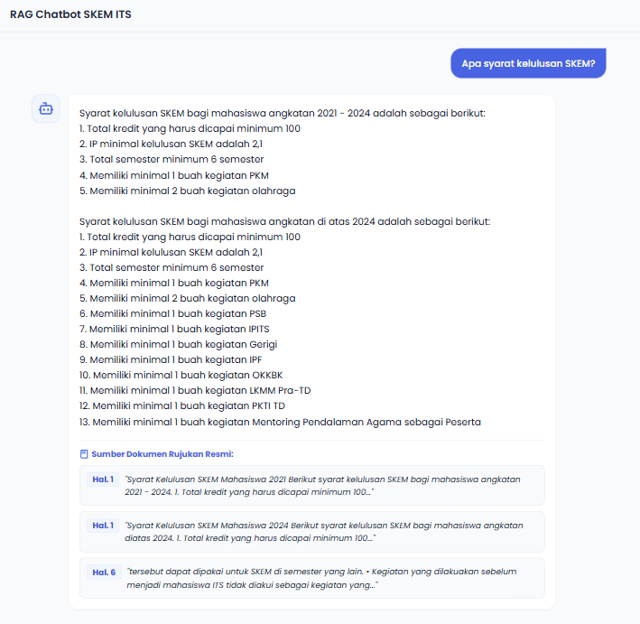
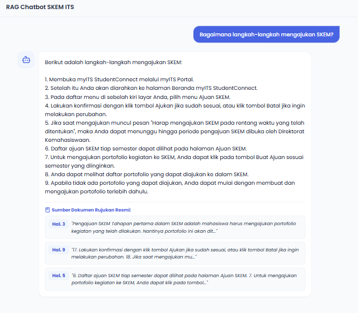
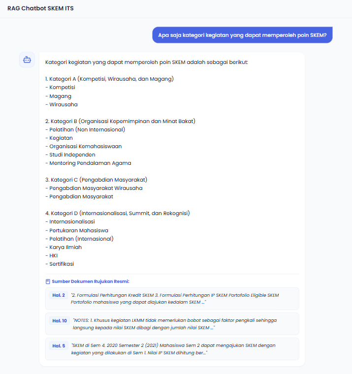
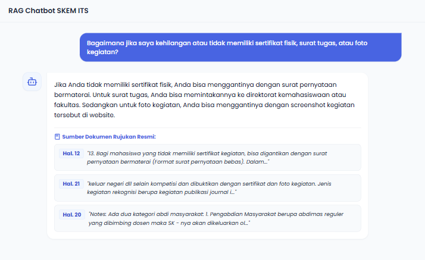
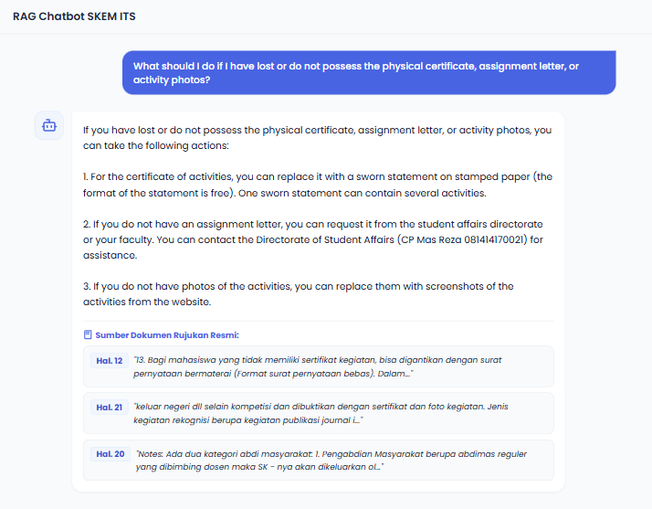
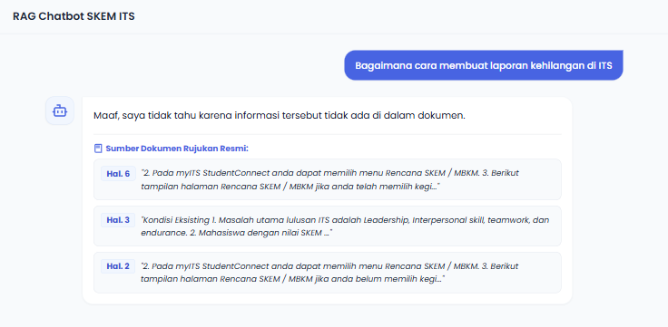

# RAG Chatbot dengan Local Semantic Caching

Aplikasi asisten AI (Chatbot) berbasis RAG (*Retrieval-Augmented Generation*) yang dirancang untuk menjawab pertanyaan pengguna berdasarkan dokumen PDF yang disediakan di dalam folder lokal. Proyek ini dilengkapi dengan fitur **Semantic Caching** berbasis FAISS lokal untuk menghemat konsumsi biaya token OpenAI API dengan cara menghindari pemanggilan LLM berulang untuk pertanyaan yang mirip.

## Fitur Utama

- **RAG (Retrieval-Augmented Generation)**: Mengambil potongan informasi yang paling relevan dari dokumen PDF lokal untuk dijadikan referensi jawaban bagi model GPT-4o-mini.
- **Local Semantic Caching**: Menggunakan basis data vektor FAISS untuk menyimpan riwayat pertanyaan dan jawaban secara lokal. Pertanyaan baru akan dibandingkan tingkat kemiripannya; jika berada di bawah ambang batas (*threshold* L2), sistem akan langsung mengembalikan jawaban dari cache tanpa memanggil API OpenAI.
- **Multilingual Support**: Chatbot akan otomatis mendeteksi bahasa penanya dan membalas menggunakan bahasa yang sama berdasarkan dokumen rujukan.
- **Log Transparan**: Menyediakan log detail pada terminal backend saat terjadi *Cache Hit*, *Cache Miss*, maupun pembaruan cache baru.

## Prasyarat Sistem

Sebelum menjalankan aplikasi, pastikan komputer Anda telah memenuhi persyaratan berikut:

- **Python**: Versi 3.9, 3.10, atau versi di atasnya.
- **OpenAI API Key**: Anda memerlukan API Key aktif dari OpenAI untuk melakukan proses pembuatan embedding dan pemrosesan LLM.

## Langkah-langkah Instalasi dan Menjalankan Aplikasi

### 1. Membuat dan Mengaktifkan Virtual Environment
Sangat disarankan untuk menjalankan aplikasi di dalam *virtual environment* Python agar tidak terjadi bentrok dengan local.

**Pada Windows (PowerShell):**
```powershell
python -m venv .venv
.\.venv\Scripts\Activate.ps1
```

**Pada macOS/Linux:**
```bash
python3 -m venv .venv
source .venv/bin/activate
```

### 2. Menginstal Dependensi Pustaka
Instal seluruh modul Python yang diperlukan dengan menjalankan perintah berikut di terminal:

```bash
pip install -r requirements.txt
```

### 4. Konfigurasi API Key (`.env`)
Buat sebuah file baru bernama `.env` di direktori utama proyek Anda, lalu masukkan OpenAI API Key Anda dengan format berikut:

```env
OPENAI_API_KEY=your-real-api-key...
```

### 5. Menjalankan Backend (FastAPI)
Gunakan perintah di bawah ini untuk menyalakan server backend FastAPI. Memanggil modul melalui `python -m` direkomendasikan untuk menghindari kendala pembatasan jalur (*path*) pada beberapa sistem Windows:

```bash
python -m uvicorn app:app --reload
```

Jika server berhasil berjalan, Anda akan melihat pesan konfigurasi RAG selesai di terminal, dan API Anda akan aktif di alamat `http://127.0.50.1:8000`.

### 6. Menjalankan Frontend (HTML)
Buka File Explorer Anda lalu klik ganda pada file `index.html` untuk membukanya secara langsung di browser. Anda juga dapat menggunakan *Live Server* di Visual Studio Code untuk membuka file ini.

## Bukti Pengujian
Berikut adalah bukti pengujian aplikasi chatbot:
1. **Pengujian Pertanyaan Sederhana**
   
   
   
2. **Pengujian Pertanyaan Bahasa Indonesia dan Inggris**
   
   
3. **Pengujian Pertanyaan dengan Jawaban yang Tidak Ada di Dokumen**
   
